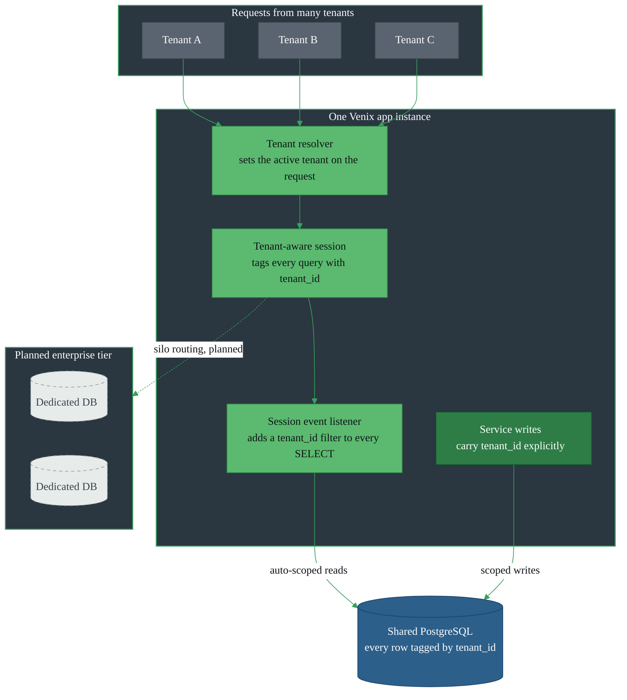
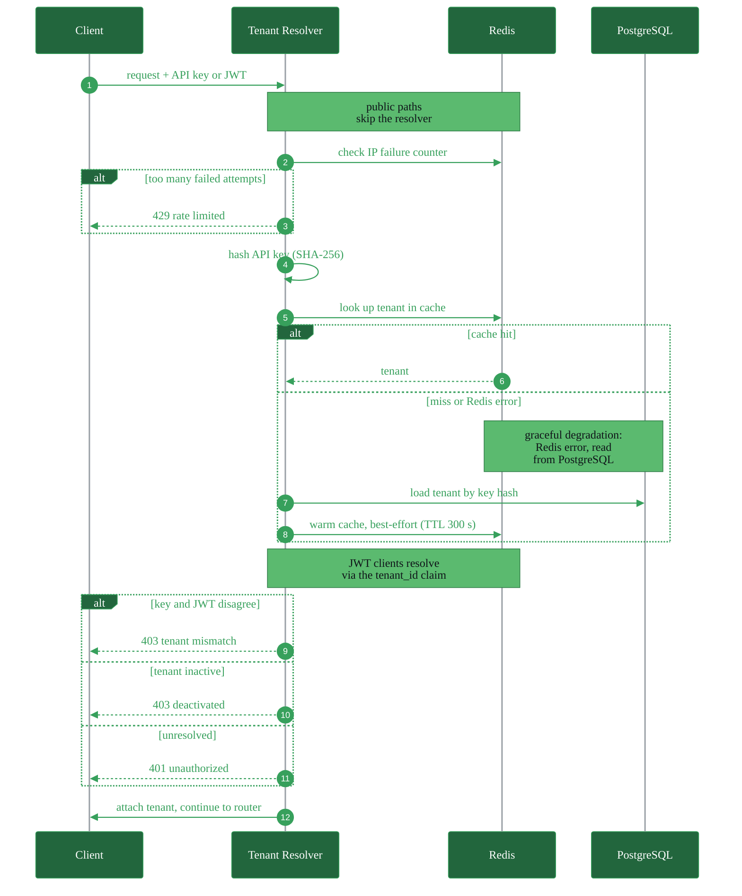
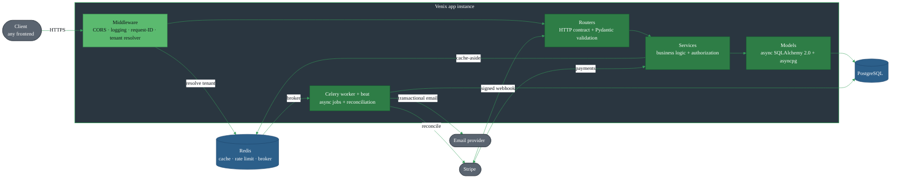
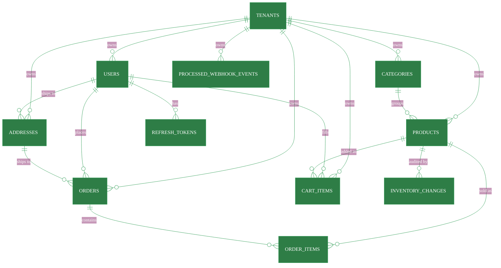
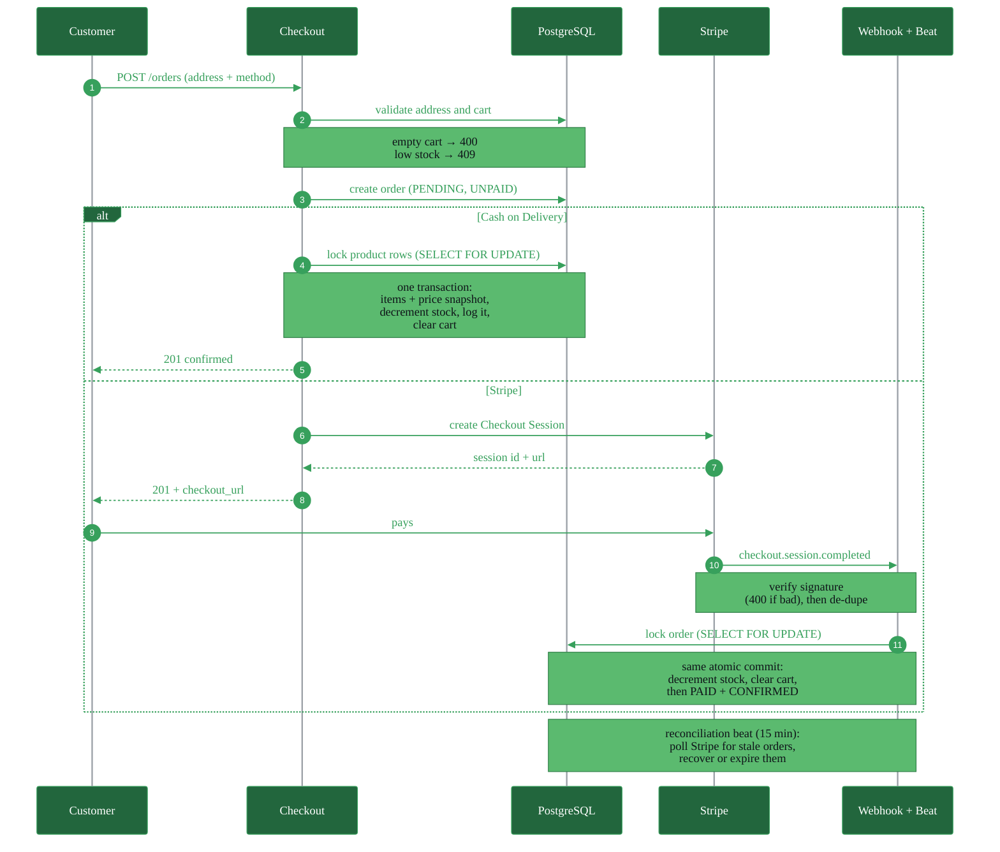
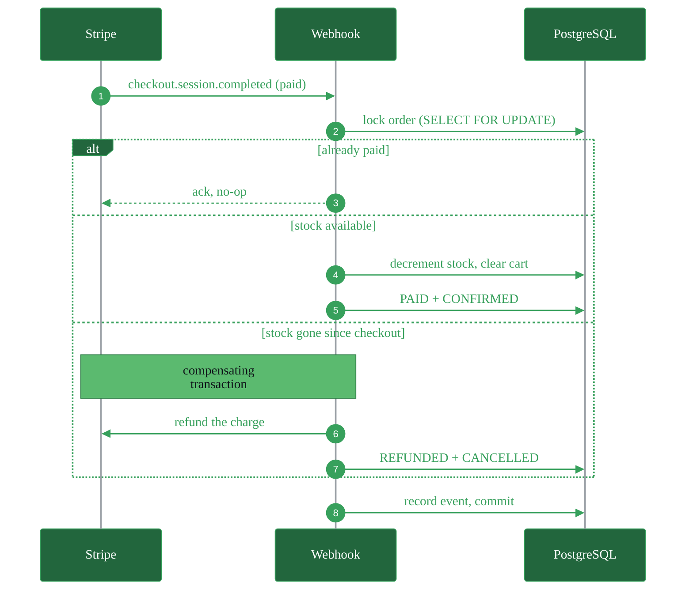
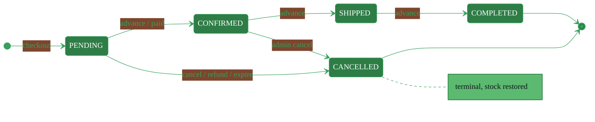

<div align="center">

<picture>
  <source media="(prefers-color-scheme: dark)" srcset="assets/logo-dark.png">
  
</picture>

### Multi-tenant, headless commerce backend-as-a-service: one API key gives any store a full production backend while Venix handles the infrastructure. For developers, technical founders, and agencies who need a commerce backend, not a CMS.

[](https://python.org)
[](https://fastapi.tiangolo.com)
[](https://postgresql.org)
[](https://sqlalchemy.org)
[](https://redis.io)
[](https://docs.celeryq.dev)
[](https://stripe.com)
[](https://docker.com)
[](https://github.com/venixhq/venix/actions)

**[Live API](https://venix.website)** · **[Interactive Docs](https://venix.website/docs)** · **[Health](https://venix.website/health)**

<sub>⏳ The live demo runs on a free tier and spins down when idle, so the first request may take ~50 s to wake.</sub>

</div>

---

## What Venix Is

Venix is a multi-tenant **SaaS platform**, a commerce **backend-as-a-service** for teams that want a real backend without operating one. A store signs up, receives one API key, and immediately has a complete, isolated production backend: authentication, catalog, cart, orders, payments, and admin. That is **zero-infrastructure onboarding**: Venix handles the infrastructure, the servers, database, cache, and background workers, so the tenant never runs any of it.

Tenants bring their own frontend (React, Next.js, a mobile app, a no-code builder, anything), hosted wherever they like. Venix owns nothing on the frontend side and imposes no template. It owns the hard part: correctness, concurrency, security, and reliability behind every endpoint.

Every tenant is fully isolated. One store can never read, write, or affect another store's data, and that guarantee is enforced by the platform itself, not by careful coding.

## Why Venix

| | Easy but rigid | **Venix** | Flexible but DIY |
|---|---|---|---|
| | Shopify · WooCommerce | API-first commerce backend | Self-hosted from scratch |
| **Frontend** | Locked to their themes | Bring your own, anywhere | Yours, but you build everything |
| **Backend** | Hidden, not yours | Production-grade, hosted for you | You build, host, and operate it |
| **Infrastructure** | Managed | Managed | Postgres, Redis, workers: all on you |
| **Time to first call** | Fast | One API key | Weeks of plumbing |

Venix fills the gap: **plug-and-play simplicity for business owners, programmatic flexibility for developers.**

## Current Status

> **Multi-tenancy is in its final stages on the `feat/multi-tenancy` branch.** The tenant model, isolation layer, and onboarding are implemented and working in code; the public deployment on `main` currently runs the single-tenant engine, pending the imminent coordinated multi-tenant merge.

---

## Architecture

Venix rests on two engineering differentiators, shown below primarily through the diagrams. Each one is traced directly from the code that implements it.

### 1 · Bridge Isolation Model

Row-level multi-tenant isolation enforced **automatically at the SQLAlchemy session layer**, not by developer discipline. A session event listener injects a `tenant_id` filter into every `SELECT` for tenant-scoped models, so a query cannot return another tenant's rows. A designed path to dedicated-database "silos" exists for a future enterprise tier.



<sub>Pool model, shipping now: one instance, one shared database, isolation enforced at the session layer. Reads are auto-scoped by the listener; writes carry <code>tenant_id</code> explicitly. The dashed path routes a tenant to a dedicated database when the silo tier ships.</sub>

### 2 · One API Key, a Full Backend

This is what makes onboarding zero-infrastructure: a single key resolves a tenant's entire backend on every request. One resolver middleware is the sole enforcement point. It hashes the key, resolves the tenant cache-first, and rejects anything unresolved, inactive, or abusive before a request reaches a route.



<sub>One key (or a tenant-scoped JWT) unlocks the whole backend. Rate limiting likewise falls back to an in-memory limiter when Redis is unavailable, so a cache outage slows the platform without breaking it.</sub>

### System at a glance



<sub>Strict layering: routers never touch the database, services own all business logic and authorization, Redis is reached only from middleware and services. Redis, Celery, and the email provider are reliability layers, never correctness dependencies.</sub>

### Data model

`tenants` is the root that every domain table hangs from; the rows below it are what the session listener scopes automatically.



<sub>Entities and key relationships only. Seven tables carry <code>tenant_id</code> directly; the rest inherit their tenant through a parent, and price snapshots on <code>order_items</code> keep order history immutable. For full column-level detail, read the model files under <a href="models/">models/</a>.</sub>

---

## Key Flows

### Atomic checkout

`SELECT FOR UPDATE` locks each product row before stock is read, so two concurrent buyers of the last unit cannot both succeed. For Cash-on-Delivery the order, stock decrement, inventory log, and cart clear commit in one transaction; for Stripe that same atomic commit runs when the signature-verified webhook confirms payment.



### Auto-refund saga

If stock is exhausted between checkout and payment confirmation, Venix cannot fulfil the order, so it runs a **compensating transaction**: refund the charge through Stripe, then mark the order refunded and cancelled.



### Order status lifecycle

Orders move through a strict finite-state machine. The row is locked before any transition is validated, and skipping or reversing a state is rejected with `409 Conflict`.



---

## Engineering Highlights

> The decisions that keep Venix correct and dependable under real traffic.

| | |
|---|---|
| 🔐 **Automatic tenant isolation** | A session event listener adds a `tenant_id` filter to every `SELECT` on tenant-scoped models. Isolation is a property of the session layer, not of individual queries. |
| 🔑 **One key, full backend** | A single resolver middleware authenticates the API key (or JWT `tenant_id` claim), enforces active status, and guards against IP brute-force. It is the sole entry gate for every request. |
| ⚛️ **Atomic checkout** | Order creation, stock decrement, inventory log, and cart clear commit in one transaction. Any failure rolls everything back: no partial orders, no phantom stock. |
| 🔒 **Concurrency-safe by construction** | `SELECT FOR UPDATE` locks product rows before reading stock; cancellations lock in deterministic order to avoid deadlocks. |
| 🛟 **Graceful degradation** | A standing principle for every external dependency: a failure degrades, it never cascades into a 5xx. Redis calls fall through to PostgreSQL and rate limiting drops to an in-memory limiter today, with the same treatment being extended to Celery. |
| 💳 **Stripe with reliability guarantees** | Signature-verified, idempotent webhooks with a dedup table, an auto-refund saga when stock runs out, and a reconciliation beat that recovers lost webhooks and sweeps stale orders. |
| 🔄 **Token rotation with reuse detection** | Refresh tokens are SHA-256 hashed and rotated on every use; presenting a revoked token is rejected. |
| 💰 **Price snapshots at purchase** | Order items capture the price at checkout, so later price changes never rewrite order history. |
| 📋 **Fully audited inventory** | Every stock change is logged with a typed reason; stock is never mutated silently. |
| ⚙️ **Full async data layer** | One event loop end to end: async routes, async SQLAlchemy 2.0 (asyncpg), async Redis. |
| 🧪 **A test suite engineered for speed** | **500+ tests run in ~16 s**: savepoint-based isolation, parallel execution via `pytest-xdist`, passwords pre-hashed once at module load. |
| 🩺 **Real readiness checks** | `/health` pings PostgreSQL, Redis, and the Celery broker, returning `503` if any dependency is down. |

---

## Features

Everything a store needs out of the box. The full, always-current API reference lives in the **[interactive Swagger docs](https://venix.website/docs)**.

| Domain | Capabilities |
|---|---|
| 🏢 **Tenancy** *(the product)* | Tenant self-registration with a one-time `vnx_` API key · API-key rotation & revocation · email verification · profile management · two-step password change · self-deactivation |
| 👤 **Auth & Identity** | Email registration with verification codes · JWT access + refresh with rotation & reuse rejection · password reset · single / all-device logout · profile editing · `CUSTOMER` / `ADMIN` RBAC |
| 🛍️ **Catalog** | Product browsing with category & price filters and pagination · product detail · category listing (Redis-cached) |
| 🛒 **Cart & Addresses** | Add / update / remove / clear cart · multiple delivery addresses with a default flag · ownership enforced |
| 📦 **Orders & Checkout** | Cash-on-Delivery & Stripe checkout · atomic, concurrency-safe order placement · reuse-if-valid Stripe sessions · paginated order history · customer cancellation |
| 💳 **Payments** | Stripe Checkout Sessions · signature-verified idempotent webhooks · auto-refund saga · scheduled reconciliation |
| 🔧 **Admin** | Full product & category CRUD · order status FSM & cancellation · user management (list, view, activate/deactivate, role changes) |
| 🛡️ **Platform** | Redis-backed rate limiting (multi-worker safe) · structured request logging · dependency health checks · async task queue with scheduled jobs |

---

## Auth System

Token-based session security designed for multi-tenant production: issuance, rotation, and revocation, all scoped per tenant.

| Capability | Detail |
|---|---|
| Registration | Email + password, validated with Pydantic v2 and `phonenumbers` (E.164) |
| Email verification | 6-digit code with a 10-minute expiry |
| Login | Short-lived access token + long-lived refresh token |
| Tenant-aware tokens | JWTs carry a `tenant_id` claim, used by the resolver for browser and dashboard clients |
| Token rotation | The old refresh token is revoked on every refresh; reuse is rejected |
| Token storage | Refresh tokens stored as SHA-256 hashes; plaintext never persists |
| Password change | Two-step, confirmation-code based |
| Password reset | Time-limited, single-use token |
| Logout | Single device or all devices at once |
| Account deactivation | Soft delete; all sessions revoked |
| RBAC | `CUSTOMER` and `ADMIN` enforced via FastAPI dependency injection |

---

## Tech Stack

| Layer | Technology |
|---|---|
| Framework | FastAPI + Uvicorn / Gunicorn |
| Database | PostgreSQL · async SQLAlchemy 2.0 (asyncpg) · Alembic migrations |
| Cache & broker | Redis: cache-aside with write-through invalidation; also the Celery broker & result backend |
| Task queue | Celery + Redis · scheduled jobs via Celery Beat · at-least-once delivery, JSON serialization |
| Payments | Stripe Checkout Sessions · signature-verified webhooks · Stripe Refund API |
| Auth | python-jose (JWT) · passlib (bcrypt) · SHA-256 token hashing |
| Validation | Pydantic v2 · email-validator · phonenumbers (E.164) |
| Rate limiting | SlowAPI, Redis-backed and multi-worker safe |
| Email | Transactional email dispatched through Celery tasks |
| Identifiers | UUIDv7 tenant keys · integer domain keys |
| Logging | Structured JSON · request-ID tracing |
| Tooling | Docker · docker-compose · pytest + pytest-asyncio + httpx + pytest-xdist · Ruff |
| Delivery | GitHub Actions CI · Render (web + worker + beat co-located) |

---

## Get Started

Venix is **API-first**. You don't deploy it; you call it.

| Step | What happens |
|---|---|
| **1 · Sign up** | Register a tenant and receive one `vnx_` API key (shown exactly once) |
| **2 · Authenticate** | Send the key as the `X-Tenant-API-Key` header; your isolated backend is live |
| **3 · Call the API** | Catalog, cart, orders, payments, and admin all respond, scoped to you |
| **4 · Build any frontend** | Wire it to your store, mobile app, or no-code builder, hosted anywhere |

The fastest way to explore the surface is the **[live interactive docs](https://venix.website/docs)**: every endpoint, schema, and status code, always current.

The live API currently runs the single-tenant engine, so the catalog is open and no key is needed yet. Try it:

```bash
curl "https://venix.website/products?limit=5&min_price=10"
```

<details>
<summary><b>Run it locally</b>, for contributors and the curious</summary>

<br/>

**Option 1 · Docker (recommended, no local Postgres/Redis needed)**

```bash
git clone https://github.com/venixhq/venix.git
cd venix
docker-compose up --build
```

The app runs at `http://localhost:8000`. Migrations apply automatically on startup, and the Celery **worker** and **beat** services start alongside the API.

**Option 2 · Local**

> Requires PostgreSQL and Redis running locally.

```bash
git clone https://github.com/venixhq/venix.git
cd venix
cp .env.example .env        # fill in DATABASE_URL, SECRET_KEY, REDIS_URL, MAIL_*
pip install -r requirements.txt
alembic upgrade head
uvicorn main:app --reload
```

Run the Celery worker separately when not using Docker:

```bash
celery -A core.celery_app worker --loglevel=info
```

> Tests don't need a running worker; `CELERY_TASK_ALWAYS_EAGER=True` runs tasks inline.

**Seed an admin user** (single-tenant runs)

```bash
# Linux / macOS
SEED_ADMIN_EMAIL=admin@example.com \
SEED_ADMIN_PASSWORD=yourpassword \
SEED_ADMIN_FIRST_NAME=Admin \
SEED_ADMIN_LAST_NAME=User \
python -m scripts.seed_admin
```

```powershell
# Windows PowerShell
$env:SEED_ADMIN_EMAIL="admin@example.com"
$env:SEED_ADMIN_PASSWORD="yourpassword"
$env:SEED_ADMIN_FIRST_NAME="Admin"
$env:SEED_ADMIN_LAST_NAME="User"
python -m scripts.seed_admin
```

> On the multi-tenant branch, the store admin is provisioned automatically when a tenant registers; manual seeding is only for the single-tenant engine.

</details>

---

## Roadmap

| Stage | Capabilities |
|---|---|
| ✅ **Shipped** | Single-tenant commerce engine: auth, catalog, cart, atomic checkout, orders, Stripe payments, admin, rate limiting, structured logging, health checks; deployed with CI |
| 🔄 **In progress** | **Multi-tenancy**: tenant onboarding & API keys, automatic per-tenant isolation, tenant-aware sessions & caching, per-tenant payment configuration, cross-tenant isolation test suite |
| 🧭 **Planned** | **Venix Dashboard** (tenant console: onboarding, key management, usage & analytics) · coupons & promotions · product relationships · reviews & wishlists · OAuth login · shipment tracking · product search |

<details>
<summary>More on what's coming</summary>

<br/>

- **Venix Dashboard**: a web console where store owners onboard, manage and rotate their API keys, and view per-tenant analytics, request volume, traffic, orders, and plan tier and usage. A separate product built on the Venix API; the same operations are available as API endpoints today.
- **Payments & commerce**: coupons and promo codes, product relationships (bundles and alternatives) for frontend-built merchandising
- **Engagement & fulfillment**: OAuth login (per-tenant credentials), shipment & delivery tracking, wishlists, purchased-only reviews & ratings with moderation, in-app notifications
- **Search**: fast, typo-tolerant product search with an isolated index per tenant
- **Platform**: richer observability, hierarchical categories, SEO slugs
- **Enterprise isolation**: the silo model, a dedicated database per tenant, provisioned on demand

</details>

---

<div align="center">

**Built by [Anas Mohamed](https://github.com/anasmohamed05221)**

*Backend engineering. No shortcuts.*

</div>
