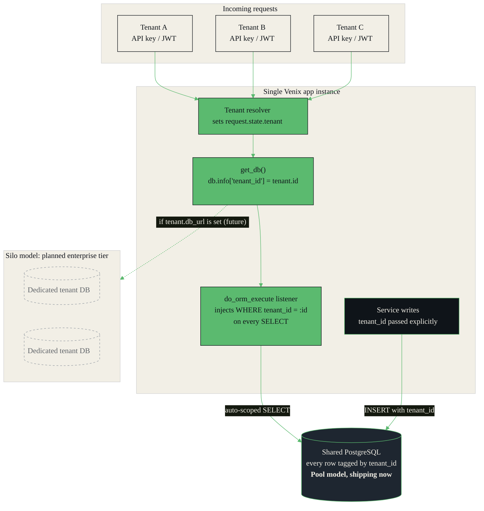
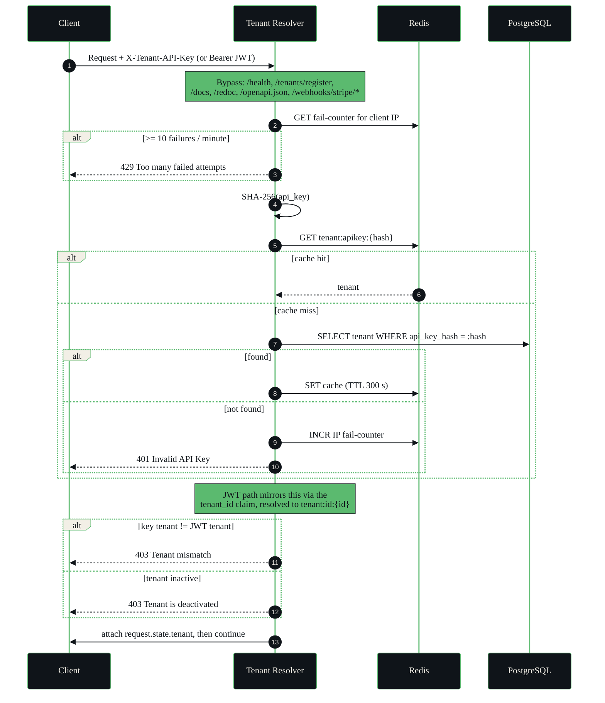
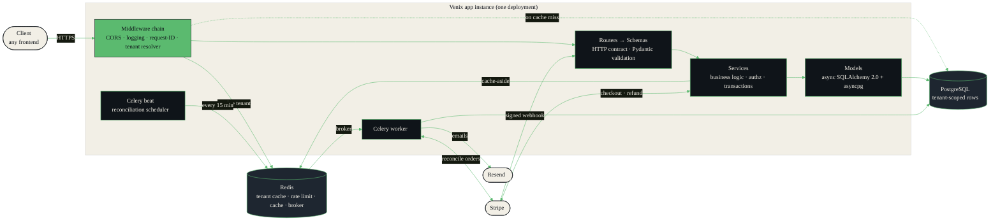
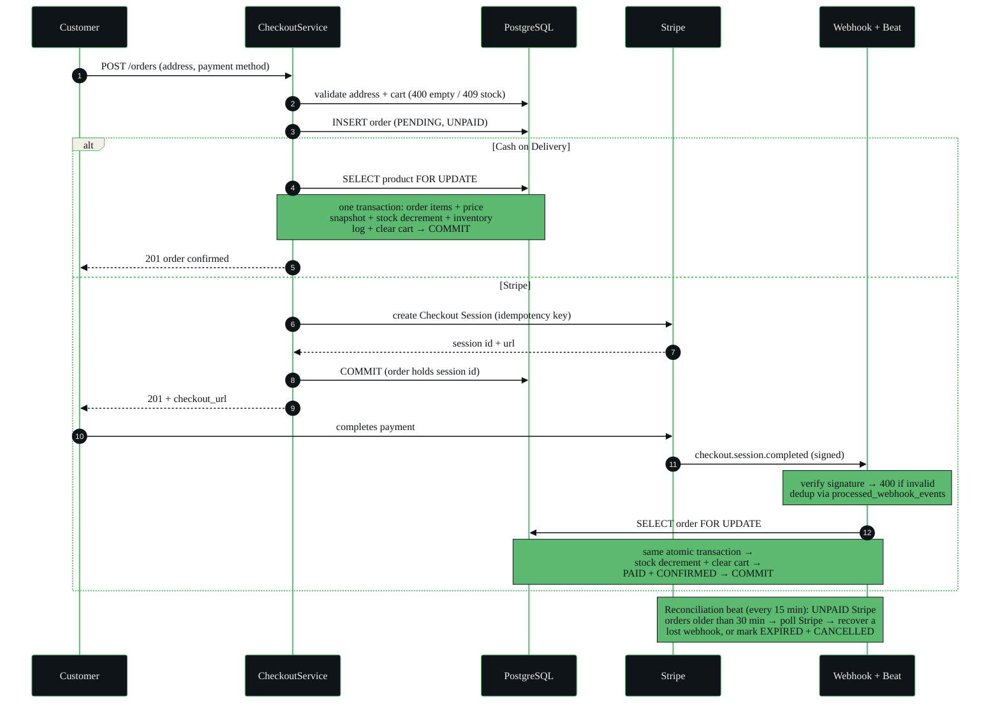
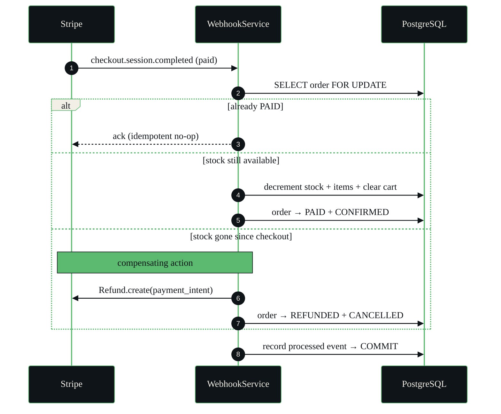
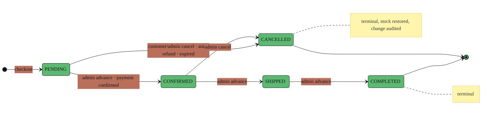
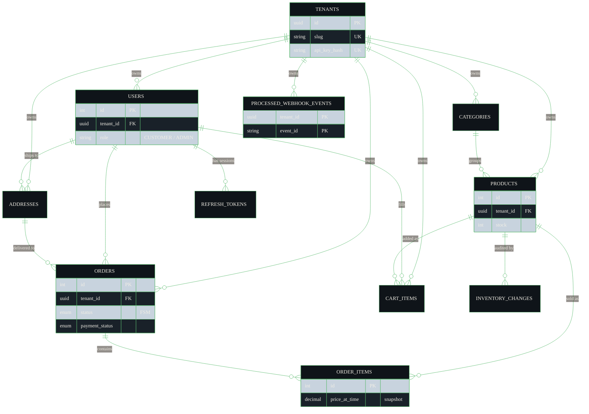

<div align="center">

<picture>
  <source media="(prefers-color-scheme: dark)" srcset="assets/logo-dark.png">
  
</picture>

### The headless, multi-tenant commerce backend: one API key, a full production store engine. Built for developers, technical founders, and agencies who need a real backend, not a CMS.

[](https://python.org)
[](https://fastapi.tiangolo.com)
[](https://postgresql.org)
[](https://sqlalchemy.org)
[](https://redis.io)
[](https://docs.celeryq.dev)
[](https://stripe.com)
[](https://docker.com)
[](https://github.com/venixhq/venix/actions)

**[Live API](https://venix.website)** · **[Interactive Docs](https://venix.website/docs)** · **[Health](https://venix.website/health)**

<sub>⏳ The live demo runs on a free tier and spins down when idle, so the first request may take ~50 s to wake.</sub>

</div>

---

## What Venix Is

Venix is a headless, multi-tenant commerce backend, effectively a store engine sold as an API-only service. A store signs up, receives one API key, and immediately has a complete, isolated production backend: authentication, catalog, cart, orders, payments, and admin. No servers to provision, no database to manage, no background workers to babysit.

Tenants bring their own frontend (React, Next.js, a mobile app, a no-code builder, anything), hosted wherever they like. Venix owns nothing on the frontend side and imposes no template. It owns the hard part: correctness, concurrency, security, and reliability behind every endpoint.

Every tenant is fully isolated. One store can never read, write, or affect another store's data, and that guarantee is enforced by the platform itself, not by careful coding.

## Why Venix

| | Easy but rigid | **Venix** | Flexible but DIY |
|---|---|---|---|
| | Shopify · WooCommerce | API-first commerce backend | Self-hosted from scratch |
| **Frontend** | Locked to their themes | Bring your own, anywhere | Yours, but you build everything |
| **Backend** | Hidden, not yours | Production-grade, hosted for you | You build, host, and operate it |
| **Infra** | Managed | Managed | Postgres, Redis, workers: all on you |
| **Time to first call** | Fast | One API key | Weeks of plumbing |

Venix fills the gap: the flexibility of a custom backend with none of the infrastructure burden.

## Current Status

> **Multi-tenancy is in its final stages on the `feat/multi-tenancy` branch.** The tenant model, isolation layer, and onboarding are implemented and working in code; the public deployment on `main` currently runs the single-tenant engine, pending the imminent coordinated multi-tenant merge.

---

## Architecture

Venix rests on two engineering differentiators. They are explained below primarily *through the diagrams*. Each one is traced directly from the code that implements it.

### 1 · Bridge Isolation Model

Row-level multi-tenant isolation enforced **automatically at the SQLAlchemy session layer**, not by developer discipline. A `do_orm_execute` event listener injects a `tenant_id` filter into *every* `SELECT` for tenant-scoped models, so a query physically cannot return another tenant's rows. A designed path to dedicated-database "silos" exists for a future enterprise tier.



<sub><b>Reads</b> are auto-scoped by the session listener; <b>writes</b> carry <code>tenant_id</code> explicitly. One instance, one shared database, hard per-tenant isolation, with a dashed path to dedicated databases on demand.</sub>

### 2 · Zero-Infrastructure Onboarding

One API key resolves to a full backend. A single middleware is the sole enforcement point: it hashes the key, resolves the tenant (cache-first, database on miss), and rejects anything unresolved, inactive, or abusive, all before a request ever touches a route.



<sub>Every Redis call degrades gracefully: on a cache outage the resolver logs a warning and falls through to PostgreSQL. The platform stays correct, just slower.</sub>

### System at a glance



<sub>Strict layering: routers never touch the database, services own all business logic and authorization, Redis is reached only from middleware and services. External dependencies (Redis, Celery, Stripe) are reliability layers, never correctness dependencies.</sub>

---

## Key Flows

### Atomic checkout

`SELECT FOR UPDATE` locks each product row before stock is read, so two concurrent buyers of the last unit can never both succeed. For Cash-on-Delivery the order, stock decrement, inventory log, and cart clear commit in **one transaction**; for Stripe the order is created, a Checkout Session is issued, and that same atomic commit happens when the signature-verified webhook confirms payment.



### Auto-refund saga

If stock is exhausted between checkout and payment confirmation, Venix can't fulfil the order, so it runs a **compensating transaction**: refund the charge through Stripe, then mark the order refunded and cancelled.



### Order status lifecycle

Orders move through a strict finite-state machine. The row is locked before any transition is validated, and skipping or reversing a state is rejected with `409 Conflict`.



---

## Engineering Highlights

> Why this is production-grade: every claim below maps to code on the branch.

| | |
|---|---|
| 🔐 **Automatic tenant isolation** | A `do_orm_execute` listener adds a `tenant_id` filter to every `SELECT` on tenant-scoped models. Isolation is a property of the session layer, not of individual queries. |
| 🔑 **One key, full backend** | A single resolver middleware authenticates the API key (or JWT `tenant_id` claim), enforces active status, and guards against IP brute-force. It is the sole entry gate for every request. |
| ⚛️ **Atomic checkout** | Order creation, stock decrement, inventory log, and cart clear commit in one transaction. Any failure rolls everything back: no partial orders, no phantom stock. |
| 🔒 **Concurrency-safe by construction** | `SELECT FOR UPDATE` locks product rows before reading stock; cancellations lock in deterministic order to avoid deadlocks. |
| 💳 **Stripe with reliability guarantees** | Signature-verified, idempotent webhooks (dedup table), an auto-refund saga when stock runs out, and a reconciliation beat that recovers lost webhooks and sweeps stale orders. |
| 🔄 **Token rotation with reuse detection** | Refresh tokens are SHA-256 hashed and rotated on every use; presenting a revoked token is rejected. |
| 💰 **Price snapshots at purchase** | Order items capture the price at checkout, so later price changes never rewrite order history. |
| 📋 **Fully audited inventory** | Every stock change is logged with a typed reason; stock is never mutated silently. |
| ⚙️ **Full async data layer** | One event loop end to end: async routes, async SQLAlchemy 2.0 (asyncpg), async Redis. |
| 🧪 **A test suite engineered for speed** | **500+ tests run in ~16 s**: savepoint-based isolation, parallel execution via `pytest-xdist`, passwords pre-hashed once at module load. |
| 🖥️ **Structured, traceable logs** | Every request emits JSON with a unique request ID, status, duration, and client IP. Stdout-only in production (12-Factor). |
| 🩺 **Real readiness checks** | `/health` pings PostgreSQL, Redis, and the Celery broker, returning `503` if any dependency is down. |

---

## Features

Capabilities, not an endpoint inventory. The full, always-current API contract lives in the **[interactive Swagger docs](https://venix.website/docs)**.

| Domain | Capabilities |
|---|---|
| 🏢 **Tenancy** *(the product)* | Tenant self-registration with a one-time `vnx_` API key · API-key rotation & revocation · email verification · profile management · two-step password change · self-deactivation |
| 👤 **Auth & Identity** | Email registration with verification codes · JWT access + refresh with rotation & reuse rejection · password reset · single / all-device logout · profile editing · `CUSTOMER` / `ADMIN` RBAC |
| 🛍️ **Catalog** | Product browsing with category & price filters and pagination · product detail · category listing (Redis-cached) |
| 🛒 **Cart & Addresses** | Add / update / remove / clear cart · multiple delivery addresses with a default flag · ownership enforced |
| 📦 **Orders & Checkout** | Cash-on-Delivery & Stripe checkout · atomic, concurrency-safe order placement · reuse-if-valid Stripe sessions · paginated order history · customer cancellation |
| 💳 **Payments** | Stripe Checkout Sessions · signature-verified idempotent webhooks · auto-refund saga · scheduled reconciliation |
| 🔧 **Admin** | Full product & category CRUD · order status FSM & cancellation · user management (list, view, activate/deactivate, role changes) |
| 🛡️ **Platform** | Redis-backed rate limiting (multi-worker safe) · structured request logging · dependency health checks · async task queue with scheduled jobs |

---

## Auth System

Not a tutorial JWT setup. Every edge case is handled, and tokens are now tenant-aware.

| Capability | Detail |
|---|---|
| Registration | Email + password, validated with Pydantic v2 and `phonenumbers` (E.164) |
| Email verification | 6-digit code with a 10-minute expiry |
| Login | Short-lived access token + long-lived refresh token |
| Tenant-aware tokens | JWTs carry a `tenant_id` claim, used by the resolver for browser/dashboard clients |
| Token rotation | The old refresh token is revoked on every refresh; reuse is rejected |
| Token storage | Refresh tokens stored as SHA-256 hashes; plaintext never persists |
| Password change | Two-step, confirmation-code based |
| Password reset | Time-limited, single-use token |
| Logout | Single device or all devices at once |
| Account deactivation | Soft delete; all sessions revoked |
| RBAC | `CUSTOMER` and `ADMIN` enforced via FastAPI dependency injection |

---

## Tech Stack

| Layer | Technology |
|---|---|
| Framework | FastAPI + Uvicorn / Gunicorn |
| Database | PostgreSQL · async SQLAlchemy 2.0 (asyncpg) · Alembic migrations |
| Cache & broker | Redis: cache-aside with write-through invalidation; also the Celery broker & result backend |
| Task queue | Celery + Redis · scheduled jobs via Celery Beat · at-least-once delivery, JSON serialization |
| Payments | Stripe Checkout Sessions · signature-verified webhooks · Stripe Refund API |
| Auth | python-jose (JWT) · passlib (bcrypt) · SHA-256 token hashing |
| Validation | Pydantic v2 · email-validator · phonenumbers (E.164) |
| Rate limiting | SlowAPI, Redis-backed and multi-worker safe |
| Email | Resend, dispatched through Celery tasks |
| Identifiers | UUIDv7 tenant keys · integer domain keys |
| Logging | Structured JSON · request-ID tracing |
| Tooling | Docker · docker-compose · pytest + pytest-asyncio + httpx + pytest-xdist · Ruff |
| Delivery | GitHub Actions CI · Render (web + worker + beat co-located) |

---

## Get Started

Venix is **API-first**. You don't deploy it; you call it.

| Step | What happens |
|---|---|
| **1 · Sign up** | Register a tenant and receive one `vnx_` API key (shown exactly once) |
| **2 · Authenticate** | Send the key as the `X-Tenant-API-Key` header; your isolated backend is live |
| **3 · Call the API** | Catalog, cart, orders, payments, and admin all respond, scoped to you |
| **4 · Build any frontend** | Wire it to your store, mobile app, or no-code builder, hosted anywhere |

The fastest way to explore the surface is the **[live interactive docs](https://venix.website/docs)**: every endpoint, schema, and status code, always current.

The live API currently runs the single-tenant engine, so the catalog is open and no key is needed yet. Try it:

```bash
curl "https://venix.website/products?limit=5&min_price=10"
```

<details>
<summary><b>Run it locally</b>, for contributors and the curious</summary>

<br/>

**Option 1 · Docker (recommended, no local Postgres/Redis needed)**

```bash
git clone https://github.com/venixhq/venix.git
cd venix
docker-compose up --build
```

The app runs at `http://localhost:8000`. Migrations apply automatically on startup, and the Celery **worker** and **beat** services start alongside the API.

**Option 2 · Local**

> Requires PostgreSQL and Redis running locally.

```bash
git clone https://github.com/venixhq/venix.git
cd venix
cp .env.example .env        # fill in DATABASE_URL, SECRET_KEY, REDIS_URL, MAIL_*
pip install -r requirements.txt
alembic upgrade head
uvicorn main:app --reload
```

Run the Celery worker separately when not using Docker:

```bash
celery -A core.celery_app worker --loglevel=info
```

> Tests don't need a running worker; `CELERY_TASK_ALWAYS_EAGER=True` runs tasks inline.

**Seed an admin user** (single-tenant runs)

```bash
# Linux / macOS
SEED_ADMIN_EMAIL=admin@example.com \
SEED_ADMIN_PASSWORD=yourpassword \
SEED_ADMIN_FIRST_NAME=Admin \
SEED_ADMIN_LAST_NAME=User \
python -m scripts.seed_admin
```

```powershell
# Windows PowerShell
$env:SEED_ADMIN_EMAIL="admin@example.com"
$env:SEED_ADMIN_PASSWORD="yourpassword"
$env:SEED_ADMIN_FIRST_NAME="Admin"
$env:SEED_ADMIN_LAST_NAME="User"
python -m scripts.seed_admin
```

> On the multi-tenant branch, the store admin is provisioned automatically when a tenant registers; manual seeding is only for the single-tenant engine.

</details>

---

## Data Model

Entities and key relationships: `tenants` is the root every domain table hangs from.



---

## Roadmap

| Stage | Capabilities |
|---|---|
| ✅ **Shipped** | Single-tenant commerce engine: auth, catalog, cart, atomic checkout, orders, Stripe payments, admin, rate limiting, structured logging, health checks; deployed with CI |
| 🔄 **In progress** | **Multi-tenancy**: tenant onboarding & API keys, automatic per-tenant isolation, tenant-aware sessions & caching, per-tenant payment configuration, cross-tenant isolation test suite |
| 🧭 **Planned** | Coupons & promotions · product relationships (bundles, upsell) · reviews & wishlists · OAuth login · shipment tracking · product search · per-tenant analytics |

<details>
<summary>More on what's coming</summary>

<br/>

- **Payments & commerce**: coupons and promo codes, product relationships (bundles / alternatives) for frontend-built merchandising
- **Engagement & fulfillment**: OAuth login (per-tenant credentials), shipment & delivery tracking, wishlists, purchased-only reviews & ratings with moderation, in-app notifications
- **Search**: fast, typo-tolerant product search with an isolated index per tenant
- **Platform**: usage metrics and per-tenant dashboards, richer observability, hierarchical categories, SEO slugs
- **Enterprise isolation**: the silo model, a dedicated database per tenant, provisioned on demand

</details>

---

<div align="center">

**Built by [Anas Mohamed](https://github.com/anasmohamed05221)**

*Backend engineering. No shortcuts.*

</div>
